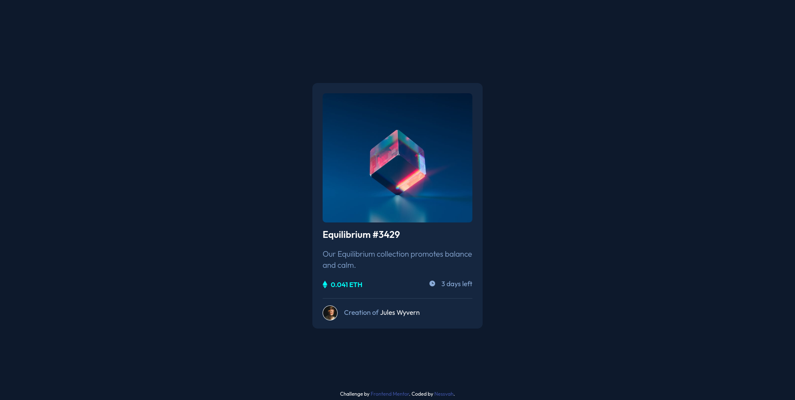
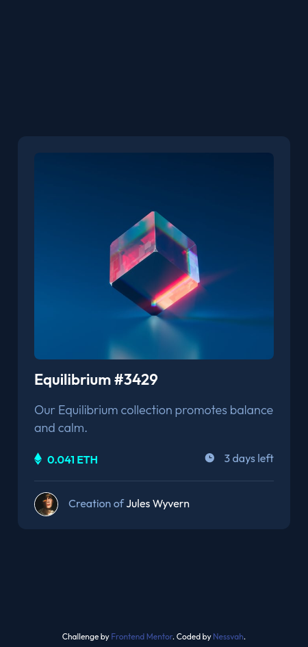

# Frontend Mentor - NFT preview card component solution

This is a solution to the [NFT preview card component challenge on Frontend Mentor](https://www.frontendmentor.io/challenges/nft-preview-card-component-SbdUL_w0U). Frontend Mentor challenges help you improve your coding skills by building realistic projects. 

## Table of contents

- [Overview](#overview)
  - [The challenge](#the-challenge)
  - [Screenshot](#screenshot)
  - [Links](#links)
- [My process](#my-process)
  - [Built with](#built-with)
  - [Continued development](#continued-development)
- [Author](#author)

## Overview

### The challenge

Users should be able to:

- View the optimal layout depending on their device's screen size
- See hover states for interactive elements

### Screenshot

### Links

- Solution URL: [https://www.frontendmentor.io/solutions/css-properties-and-flexbox-gh2MqYyAJ]
- Live Site URL: [https://nessvah.netlify.com]

## My process

I started structuring first the html and struggled a bit with the new semantic HTML markup since I didn't know exactly what to use since it was just a card. 

The main difficulty was positioning and centering the elements, even with flexbox I dind't knew exactly how it worked. 

Another major difficulty was the hover state on the image. 

### Built with

- Semantic HTML5 markup
- CSS custom properties
- Flexbox

### Continued development

Need to continue to practice the basics for html and css specially about positioning and layouts. 

## Author

- Frontend Mentor - [@nessvah](https://www.frontendmentor.io/profile/Nessvah)
- Twitter - [@Nessvah_](https://www.twitter.com/nessvah_)

